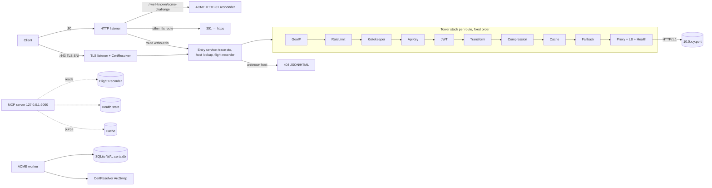

# IMPLEMENTATION PLAN: `paasers`, PaaS Edge Gateway (Rust)

> Master document. Source of truth: `SPECS.md` + this plan + the sub-plans `plans/*.md`.
> **In case of conflict: sub-plan > PLAN.md > SPECS.md** (sub-plans refine; they only contradict to resolve an ambiguity, and this is then flagged with "DECISION").
> All **external crate** APIs cited have been verified in their source, and the snippets marked "validated"/"compiled" have been **compiled (strict clippy) and tested** (spike, rustc 1.95.0, 2026-09-30): see §12. Algorithms described in prose (cache, transform, rate-limit...) are to be implemented as specified.

---

## 0. How to use this plan (implementing agent)

1. Read this file in full, then `plans/00-conventions.md` (**mandatory** code rules), then `plans/01-config.md` (the central data model).
2. Implement **phase by phase** in the order of §7. Each phase has a sub-plan with: files to create, signatures, algorithm, tests to write, *Definition of Done* (DoD).
3. After each file: `cargo check --message-format=short`. After each phase: `cargo clippy --all-targets -- -D warnings` + `cargo test <module>` (never a full `cargo test`, except in the final phase §7 P12).
4. Commit each time a phase DoD is reached: `git commit -m "P<n>: <title>"`.
5. Never invent a config option absent from `plans/01-config.md`. Never add a dependency absent from `plans/00-conventions.md` §2.

---

## 1. Recommended approach (overview)

### 1.1 Principles
* **A single static binary** (`x86_64-unknown-linux-musl`, validated: 3.5 MB stripped), one KDL config file, one SQLite file. Zero external services.
* **Data plane = Tower stack per route**, built once at config load, stored in an immutable snapshot `Arc<Runtime>` behind an `ArcSwap`. Hot-reload atomically replaces the snapshot. In-flight requests keep the old `Arc`.
* **Shared mutable state outside the snapshot** (survives reload): upstream health, HTTP cache, rate-limiters, gatekeeper sessions, flight recorder, certificates. Each state is indexed by a stable key (`route_id` = first hostname of the route) so it can be reused between two snapshots.
* **No panics**: lints `unwrap_used/expect_used/panic/indexing_slicing = deny` (outside tests). Each connection is an isolated `tokio` task. Any request error produces a response (4xx/5xx/fallback), never a crash.

### 1.2 Architecture



### 1.3 Middleware order (DECISION, justified)
Order **outer → inner** (the first one sees the request first):

| # | Layer | Why at this position |
|---|-------|------------------------|
| 0 | `Entry` (outside the stack) | trace-id, route resolution, flight-recorder recording, `traceparent`/`X-Request-Id` headers on the response |
| 1 | `GeoIpLayer` | cheapest possible rejection (mmap lookup), and adds `X-Country-Code` |
| 2 | `RateLimitLayer` | protects everything that follows (including the gatekeeper's argon2) |
| 3 | `GatekeeperLayer` | serves `/__gate/*` + requires a session cookie |
| 4 | `ApiKeyLayer` | machine auth |
| 5 | `JwtLayer` | user auth + claims injection |
| 6 | `TransformLayer` | manipulates req (to backend) and resp (to client) after auth |
| 7 | `CompressionLayer` | compresses the final response, **including the one coming from the cache** |
| 8 | `CacheLayer` | stores the **uncompressed** representation (single variant, no `Vary: Accept-Encoding` to handle) |
| 9 | `FallbackLayer` | turns proxy 502/503/504 into a maintenance page (not cached because the cache does not store these statuses) |
| 10 | `ProxyService` | weighted upstream selection among healthy ones, HTTP/1.1 forwarding, WebSocket upgrade |

A layer not configured on the route **is not inserted** (zero cost), except `FallbackLayer`, which is always present (convention).

### 1.4 Decisions settling the ambiguities of SPECS.md

| # | Ambiguity | DECISION |
|---|-----------|----------|
| D1 | KDL v1 or v2? The SPECS example uses bare `true` (v1 only). | Crate `kdl` 6.7 feature `v1-fallback`: tries v2 then v1. **Both syntaxes are accepted**; the SPECS example is valid KDL as is (tested). It only passes **validation** after replacing the truncated PSK hash (R7), with `JWT_SECRET_KEY` defined and an existing GeoIP file. Documentation in v2 (`#true`). |
| D2 | "ponds continus" (health-check) | = *probes*. HTTP probe `GET <path>` (default `/`); any status `< 500` = healthy. Option `mode="tcp"` = plain TCP connection. |
| D3 | "instant removal from the routing table" | The proxy only chooses among `healthy` upstreams (atomic `AtomicBool` read). No router rebuild. **Passive health** in addition: a connection error immediately marks the upstream unhealthy. If **no** healthy upstream → 503 + fallback. |
| D4 | "Incident ID = W3C trace_id" | trace_id 32 hex (128 bits). If the incoming request carries a valid `traceparent`, its trace_id is **reused**; otherwise one is generated. New span_id at each hop. |
| D5 | Fallback "HTML/JSON" | Negotiation: `Accept` contains `application/json` and not `text/html` → JSON; otherwise HTML. |
| D6 | TOTP "built-in" (empty line in SPECS) | Optional 2nd factor of the gatekeeper: `totp-secret "<base32>"` in the config (shared by the site's team, like the PSK). If present, the form requires PSK **and** a 6-digit TOTP code. Replayed codes are refused (step already used, in memory). |
| D7 | Passkey "after first PSK login" | After PSK(+TOTP) login, page `/__gate/passkey` offers registration. Subsequent login possible with the passkey **alone** (button on the form). Passkeys stored in SQLite per `route_id`. Enabled only if `passkey #true` in `gatekeeper`. |
| D8 | Gatekeeper session | **Stateless cookie signed with HMAC-SHA256** (random 32-byte key persisted in SQLite table `secrets`, so it survives restarts). No sessions table. Global revocation = change the PSK (the PSK hash is part of the signature). |
| D9 | Cache "memory/mmap" | **Memory only** (`quick_cache`, weighted in bytes, S3-FIFO). mmap rejected (YAGNI, invalidation complexity). Documented as risk/alternative §8 R8. |
| D10 | RFC 9111 cache: scope | **Shared** cache: GET/HEAD, statuses 200/203/204/300/301/308/404/410, `s-maxage` > `max-age` > `Expires`; `no-store`, `private`, `Authorization` (except `public`/`s-maxage`), `Set-Cookie`, `Vary: *` ⇒ not stored. No freshness heuristic (no TTL without an explicit header), except `default-ttl` if configured. `stale-while-revalidate` = config value, **overridden** by the response directive if present. Background revalidation (only 1 per key). Details `plans/08-cache.md`. |
| D11 | Purge by `Surrogate-Key` tags | Backend response header `Surrogate-Key: a b c` (space-separated) remembered; **removed** from the client response. Purge via MCP `purge_cache` (by tags, by host, or everything). |
| D12 | JWT: secret-env HMAC only? | Key sources: `secret-env` (HMAC HS256/384/512), `public-key-file` (PEM RSA/EC/Ed25519). Exactly one. `algorithms` default inferred from the key. No remote JWKS (zero network dependency, KISS). |
| D13 | JWT: where is the token? | `Authorization: Bearer <t>` then optional cookie (`cookie "name"`). Missing/invalid ⇒ 401 JSON with `WWW-Authenticate: Bearer`. |
| D14 | Claims injection | `inject-headers #true` ⇒ `X-User-Id` = `sub`, `X-User-Email` = `email`, `X-User-Roles` = `roles` (array joined with `,`) if present, + `X-Jwt-Claims` = base64url(JSON claims). Incoming `X-User-*`/`X-Jwt-Claims` headers are **always removed** (anti-spoofing) even if inject is off. |
| D15 | API keys | `api-keys header="X-Api-Key" { key "<sha256 hex>" name="ci" ... }`. Constant-time comparison of the header's SHA-256. Header removed before forwarding, `X-Api-Key-Name` injected. |
| D16 | Auth combination | Each configured auth layer is **mandatory** (logical AND). Single exception: if `api-keys` **and** `jwt-validation` are configured, a valid API key **exempts** from JWT (the ApiKeyLayer sets the `ApiKeyAuthenticated` extension, the JwtLayer reads it). The gatekeeper is an environment barrier that is **always** mandatory when configured, without exception. |
| D17 | Rate-limit | `rate-limit rps=100 burst=200` per **client IP** and per **route** (key = IP, one limiter per route). Override by path prefix possible: `rate-limit rps=5 burst=10 path="/api/login"`. Exceeded ⇒ 429 + `Retry-After`. Client IP = TCP IP; `X-Forwarded-For` is read **only** if the TCP IP ∈ `trusted-proxies` (default empty). |
| D18 | GeoIP | `block-countries` and/or `allow-countries` (mutually exclusive), `inject-header` default `#true` (`X-Country-Code`). IP without result ⇒ `XX`, never blocked by `block`, blocked by `allow`. Blocking ⇒ 403. Database opened once, shared (Arc) between routes by path. |
| D19 | Compression | Algorithms that can be enabled: `gzip` (default on), `brotli` (default on), `zstd` (default on). Min size 1024 B. No compression if already encoded, images, gRPC, SSE, 101, 204, 304, `Content-Range`. |
| D20 | Transform | See `plans/10-security-layers.md` §6: `request { set/add/remove/replace }`, `response { set/add/remove/replace }`, `status from=X to=Y`. Regex on header values only (no body: streaming). |
| D21 | TLS without `tls` on a route | Route served in plain HTTP only on :80; on :443 unknown SNI ⇒ handshake refused. |
| D22 | ACME challenge | **HTTP-01** served on :80 (simplest, no DNS). TLS-ALPN-01 rejected. Staging/prod configurable (`acme-directory`). Renewal when `not_after - now < 30 d`, check every 12 h, jitter. While waiting for the 1st cert: a temporary **self-signed** certificate is served (avoids a handshake failure). |
| D23 | Upstream over TLS? | No (private network). Plain HTTP/1.1 upstreams only (YAGNI). Validation: the host must be a literal IP (v4 or v6) + port; warning (not error) if not private (RFC1918/ULA/loopback). |
| D24 | Hot reload | `SIGHUP` **and** mtime watcher (2 s poll) of the config file. Invalid config ⇒ error log + old config kept. Change of `listen`/`storage-path`/`mcp-server` ⇒ "requires restart" warning, ignored. |
| D25 | MCP transport | rmcp 3.5 **Streamable HTTP** (successor of SSE), stateless, JSON responses, mounted on hyper at `POST /mcp`. Auth `Authorization: Bearer <token>` checked before rmcp (constant time). If `token` is absent ⇒ the listener must be loopback, otherwise config error. |
| D26 | Flight recorder | 500 entries (config `flight-recorder capacity=500`), statuses ≥ 400 + transport errors. Ring buffer `Mutex<VecDeque>` (O(1) critical section, never held across an `.await`). |
| D27 | Observability `tracing` vs `fastrace` | `tracing` + `tracing-subscriber` (JSON or text logs) for **logs**; `fastrace` only for its W3C `SpanContext` type (encode/decode `traceparent`), no reporter installed. |
| D28 | Allocator | `mimalloc` (low and stable RSS, musl malloc is slow). |
| D29 | Binary/crate name | `paasers`. CLI: `paasers run -c <file>`, `paasers check -c <file>`, `paasers hash-password`, `paasers hash-api-key`, `paasers gen-totp`. |
| D30 | Routing: host only or host+path? | **Host only** (SPECS: "Host-based routing"). A hostname belongs to exactly one route (duplicate ⇒ config error). `matchit` serves as a radix tree over **reversed DNS labels** (`www.client.com` ⇒ `/com/client/www`, wildcard `*.client.com` ⇒ `/com/client/{w}`), tested. Per-path overrides exist only in `rate-limit path=` (prefix). |
| D31 | Semantics of `listen` | 1st argument = HTTP, 2nd = HTTPS (order of the SPECS example). `":80"` = dual-stack socket `[::]:80` (`set_only_v6(false)`, tested) accepting IPv4 and IPv6. See `plans/01-config.md`. |
| D32 | Project language | English only: plans, code, comments, logs, error messages, UI default texts, MCP descriptions, README and commits (see plans/00 §3 rule 1). French texts quoted from SPECS.md (e.g. the gatekeeper `title` in the example) remain valid config values but are never defaults. |

---

## 2. Data model / API changes

Greenfield project: everything is new. Exhaustive details in the sub-plans; summary:

### 2.1 Configuration model (Rust) — `plans/01-config.md`
```text
Config { gateway: GatewayCfg, mcp: Option<McpCfg>, routes: Vec<RouteCfg> }
GatewayCfg { listen_http, listen_https: Option<SocketAddr>, storage_path, acme_directory, acme_email: Option<String>,
             trusted_proxies: Vec<IpNet>, flight_recorder_capacity, log_format, limits: Limits }
RouteCfg { id: Arc<str> (=hosts[0]), hosts: Vec<String>, tls: Option<TlsCfg>, redirect_https: bool,
           upstreams: Vec<UpstreamCfg>, health: HealthCfg, timeouts: TimeoutCfg,
           cache, compression, geoip, rate_limits: Vec<RateLimitCfg>, gatekeeper, jwt, api_keys, transform,
           fallback: FallbackCfg }
```
All fields have a **documented default** (exhaustive table in `plans/01-config.md` §3).

### 2.2 SQLite schema (`storage-path`, WAL) — `plans/03-storage.md`
```sql
CREATE TABLE IF NOT EXISTS meta        (key TEXT PRIMARY KEY, value TEXT NOT NULL);           -- schema_version
CREATE TABLE IF NOT EXISTS secrets     (name TEXT PRIMARY KEY, value BLOB NOT NULL);          -- session HMAC key
CREATE TABLE IF NOT EXISTS acme_account(directory TEXT PRIMARY KEY, credentials TEXT NOT NULL, created_at INTEGER NOT NULL);
CREATE TABLE IF NOT EXISTS certs       (domain TEXT PRIMARY KEY, cert_pem TEXT NOT NULL, key_pem TEXT NOT NULL,
                                        not_after INTEGER NOT NULL, issued_at INTEGER NOT NULL);
CREATE TABLE IF NOT EXISTS passkeys    (id INTEGER PRIMARY KEY AUTOINCREMENT, route_id TEXT NOT NULL,
                                        cred_id BLOB NOT NULL UNIQUE, passkey_json TEXT NOT NULL, label TEXT NOT NULL,
                                        created_at INTEGER NOT NULL, last_used_at INTEGER);
CREATE INDEX IF NOT EXISTS passkeys_route ON passkeys(route_id);
```

### 2.3 HTTP surfaces exposed by the gateway
| Endpoint | Listener | Role |
|---|---|---|
| `GET /.well-known/acme-challenge/{token}` | :80 | HTTP-01 |
| `GET/POST /__gate/login` | gatekeeper route | PSK(+TOTP) form |
| `POST /__gate/logout` | same | clears cookie |
| `GET /__gate/passkey` , `POST /__gate/passkey/register/{start,finish}` , `POST /__gate/passkey/login/{start,finish}` | same | WebAuthn |
| `POST /mcp` (+ `GET`/`DELETE` handled by rmcp) | MCP listener | MCP JSON-RPC |
| `GET /healthz` | MCP listener | `200 ok` (infra probe, no token) |

### 2.4 Headers added/removed
* To backend: `X-Forwarded-For` (append), `X-Forwarded-Proto`, `X-Forwarded-Host`, `X-Real-IP`, `Forwarded` **not** added, `traceparent` (new span), `X-Request-Id` (= trace_id), `X-Country-Code`, `X-User-*`, `X-Api-Key-Name`. Hop-by-hop removed (RFC 9110 §7.6.1).
* To client: `traceparent`, `X-Request-Id`, `X-Cache: HIT|MISS|STALE|BYPASS` (if cache configured), `Age` (hits), `Surrogate-Key` removed. The backend's `Server` header is kept as is; the gateway does not add one.

### 2.5 MCP tools — `plans/11-mcp.md`
`get_route_status`, `query_flight_recorder`, `inspect_incident`, `purge_cache` (+ exact input/output JSON Schemas in `plans/11-mcp.md`).

---

## 3. UI / workflow changes

* **Gatekeeper UI** (the only UI): a single inlined HTML page (`include_str!`), inline CSS/JS, zero CDN, zero external font, < 12 KB, strict CSP with nonce. Mockup and exact texts: `plans/09-gatekeeper.md` §UI. English by default, `title` configurable.
* **Fallback page**: inline HTML < 4 KB, shows status, message, **Incident ID** (trace_id) with a "Copy" button, UTC time. JSON variant. `plans/06-fallback-observability.md`.
* **Operator workflow**:
  1. `paasers hash-password` (reads stdin) ⇒ paste the hash into `psk`.
  2. `paasers check -c gateway.kdl` in GitOps CI (exit ≠ 0 + diagnostics with line/column).
  3. File deployment ⇒ automatic reload (mtime) or `systemctl reload paasers` (SIGHUP).
  4. Support: the user provides the Incident ID ⇒ the AI agent calls `inspect_incident(id)`.

---

## 4. Edge cases (reference list; each sub-plan details its own)

**Network / protocol**
1. Missing (HTTP/1.0) or invalid Host ⇒ 400. Host with port (`a.com:443`) ⇒ port removed. Uppercase Host / trailing dot ⇒ normalized (`lowercase`, trim `.`).
2. HTTP/2 client ⇒ the request is **rewritten as HTTP/1.1** before forwarding (the hyper-util client refuses `Version::HTTP_2`: `UserUnsupportedVersion`, observed in the spike). `:authority` header ⇒ `Host`.
3. WebSocket (`Upgrade`): HTTP/1.1 only; bidirectional tunnel `copy_bidirectional` (tested). Compression/cache ignore 101s. The request timeout only covers waiting for the response headers, never the tunnel. WebSocket over h2 (RFC 8441) not supported: the gateway does not enable `enable_connect_protocol`, so browsers use HTTP/1.1 for WebSockets.
4. Request body > `max-body` (default 100 MiB) ⇒ 413 (via `Content-Length` upfront, otherwise `Limited` while streaming ⇒ 413 if the response has not started yet).
5. Slow backend: fixed connect timeout 5 s (⇒ 502), `timeouts request=` (until response headers) 60 s ⇒ 504 + fallback. Client side: `header-read-timeout` 30 s (slowloris **and** HTTP/1.1 keep-alive inactivity), HTTP/2 ping 30 s/20 s.
6. Backend cuts off in the middle of the response body ⇒ impossible to change the status: the client connection is aborted, flight-recorder entry `kind=upstream_body_error`.
7. `Expect: 100-continue`: the hyper server sends `100 Continue` automatically on the first body read; the `Expect` header is **removed** before forwarding.
8. Proxy loop (upstream = the gateway itself): the gateway adds `Via: 1.1 paasers` toward the backend; an incoming request whose `Via` already contains `paasers` ⇒ 508 Loop Detected.
9. IPv4-mapped IPv6 (`::ffff:1.2.3.4`) ⇒ canonicalized (`to_canonical`, tested) for rate-limit/GeoIP/logs.

**TLS / ACME**
10. Missing SNI ⇒ `default-cert` certificate if configured, otherwise handshake refused.
11. Wildcard as route host (`*.client.com`): accepted for routing; **ACME HTTP-01 cannot issue it** ⇒ config error if `tls` without `cert-file` on a wildcard.
12. Let's Encrypt rate limit / ACME failure ⇒ exponential backoff (1 min → 24 h), the temporary/old cert keeps being served, flight-recorder entry `kind=acme`.
13. Two routes sharing a hostname ⇒ config error (D30).
14. Certificate in the database for a domain removed from the config ⇒ kept (no automatic deletion), not served.

**Auth**
15. Tampered/expired session cookie ⇒ redirect to login (HTML) or 401 (request with `Accept: application/json` or method ≠ GET).
16. Brute force: limiter per IP **and** global per route (`attempts`/`window`) ⇒ 429 login page with delay.
17. Invalid argon2 hash in the config ⇒ config error (validated at parse time via `PasswordHash::new`, tested: the truncated hash of the SPECS example `...` is **rejected**, see §8 R7).
18. Argon2 is CPU-bound (~20-50 ms) ⇒ executed in `spawn_blocking`, semaphore of max 2 concurrent verifications.
19. JWT `alg: none` / non-allowed alg ⇒ rejected (jsonwebtoken only accepts `Validation.algorithms`). `exp` required, `leeway` 60 s.
20. System clock: TOTP skew ±1 step.

**Cache**
21. Gatekeeper session cookie: **removed** from the `Cookie` header by the GatekeeperLayer (before cache and backend), it influences neither the cache key nor the backend. Request with `Authorization` ⇒ stored only if the response carries `public` or `s-maxage` (RFC 9111 §3.5); an entry only serves a request with `Authorization` if it was stored under that condition (field `auth_ok`).
22. Thundering herd on MISS: **no** coalescing (YAGNI v1); for STALE, only one revalidation per key (`revalidating` set).
23. Response without `Content-Length` larger than `max-object-size` (default 8 MiB) ⇒ streamed, not cached (TeeBody drops the buffer, tested).
24. `HEAD` served from a `GET` entry.

**Config / reload**
25. Reload during traffic: in-flight requests finish on the old snapshot. State (health, cache, limiters) reused if `route_id` is identical; cache **cleared** for the route if its upstreams or its cache config change.
26. Config file deleted/partially written ⇒ parse fails ⇒ old config kept; atomic write (rename) recommended.
27. `secret-env` missing from the environment ⇒ config error (at load time, not at request time).

**Resources**
28. RAM budget < 32 MB at rest (raised from 20 MB): no cache pre-allocation (quick_cache allocates on use), `max-size` is a **ceiling**. Document: RSS = base (~8-12 MB) + cache used.
29. Too many connections: `max-connections` (default 10,000) via `Semaphore`; beyond that, `accept` then immediate close.

---

## 5. Test plan

Per-module details in each sub-plan ("Tests" section). Overall strategy:

| Level | Tool | Content | Command |
|---|---|---|---|
| Unit | `#[cfg(test)] mod tests` in each file | KDL parsing (each node, each default, each error), cache-control, cache key, JWT (HS/RS/Ed, exp, iss, aud, alg none), rate-limit (quota, Retry-After), ring buffer (overflow, order, filters), traceparent, HMAC cookie, argon2/TOTP, GeoIP (`GeoIP2-Country-Test.mmdb` MIT fixture), weighted selection, transform regex | `cargo test <module>::` |
| Layer (Tower) | `tower::ServiceExt::oneshot` on a dummy `service_fn` | each Layer isolated: input ⇒ expected output | `cargo test layers::` |
| Integration | `tests/*.rs`, upstream = ephemeral local hyper server (`127.0.0.1:0`), client = hyper client / raw `TcpStream` | e2e proxy, LB 90/10 (unit: 100,000 draws ∈ [0.88; 0.92]; HTTP: 1,000 requests ∈ [0.85; 0.95]), health removal/return, fallback + Incident ID found via MCP, WS echo, TLS SNI with rcgen test CA (tested in the spike), atomic reload, full gatekeeper flow, h2 client ⇒ h1 backend | `cargo test --test <name>` |
| ACME | `pebble` v2.10.1 (binary `pebble-linux-amd64.tar.gz`) + `builder_with_root(pebble.minica.pem)` | issuance + persistence + forced renewal | `cargo test --test acme -- --ignored` (CI only, requires pebble) |
| MCP | raw JSON-RPC requests (`initialize`, `tools/list`, `tools/call`) over hyper (tested in the spike) | 4 tools + token auth | `cargo test --test mcp` |
| Property/light fuzz | parameterized tests (tables) | parsing of `Cache-Control`, `traceparent`, Host: malformed inputs never panic | included in unit tests |
| Memory | script `scripts/rss.sh`: starts the release binary with the example config, 1,000 req, reads `VmRSS` from `/proc/<pid>/status` | assert < 32 MB with empty cache | CI job `perf` |
| Load (manual) | `oha` or `wrk` | p99 and absence of errors | outside CI |

SPECS rule respected: during development, never a full `cargo test`; phase P12 runs the full suite once.

---

## 6. Rollout plan

1. **Build**: `cargo zigbuild --release --target x86_64-unknown-linux-musl` (validated, openssl vendored for webauthn). Artifact + `sha256sum`.
2. **Packaging**: systemd unit provided (`deploy/paasers.service`): `User=paasers`, `AmbientCapabilities=CAP_NET_BIND_SERVICE`, `ExecReload=/bin/kill -HUP $MAINPID`, `StateDirectory=gateway` (→ `/var/lib/gateway`), `ProtectSystem=strict`, `MemoryMax=64M` (safeguard), `LimitNOFILE=65536`.
3. **Production rollout steps**:
   * **Stage 0 (shadow)**: deploy on a test VM with `acme-directory "staging"`, real routes to pre-prod backends. Check staging certificates, `paasers check`, MCP.
   * **Stage 1 (DNS canary)**: a low-criticality client domain pointed at the new gateway, prod ACME. Monitor the flight recorder via MCP for 48 h.
   * **Stage 2**: domain-by-domain migration (DNS is the rollback lever).
   * **Stage 3**: advanced features (cache, JWT, GeoIP) enabled route by route via config (feature flags = presence of the KDL node).
4. **Rollback**: previous binary kept (`/usr/local/bin/paasers.prev`), SQLite schema **additive only** (backward compatibility), config versioned in GitOps (`git revert`).
5. **DB migrations**: `meta.schema_version`; idempotent migrations `CREATE ... IF NOT EXISTS`; any future non-additive migration = new table.

---

## 7. Implementation phases (strict order)

| Phase | Sub-plan | Deliverable | Depends on |
|---|---|---|---|
| P0 | `plans/00-conventions.md` | cargo skeleton, exact `Cargo.toml`, lints, CI script, base types (`Body`, `RouteSvc`, errors) | — |
| P1 | `plans/01-config.md` | KDL parse ⇒ validated `Config` + `paasers check` | P0 |
| P2 | `plans/02-server-core.md` | listeners, accept loop, entry service, graceful shutdown, reload, CLI | P1 |
| P3 | `plans/03-storage.md` | SQLite WAL + repo (secrets, certs, passkeys, acme) | P0 |
| P4 | `plans/04-routing.md` | host→route table (`matchit`), `ArcSwap` snapshot, runtime builder | P1 |
| P5 | `plans/05-proxy-upstream.md` | proxy, weighted LB, active/passive health, WS, headers | P2, P4 |
| P6 | `plans/06-fallback-observability.md` | trace context, flight recorder, fallback page | P5 |
| P7 | `plans/07-tls-acme.md` | SNI resolver, self-signed cert, ACME HTTP-01, renewal | P3, P2 |
| P8 | `plans/08-cache.md` | RFC 9111 cache + SWR + tags | P5 |
| P9 | `plans/09-gatekeeper.md` | PSK, TOTP, cookie, auth rate-limit, passkeys, UI | P3, P5 |
| P10 | `plans/10-security-layers.md` | JWT, API key, rate-limit, GeoIP, compression, transform | P5 |
| P11 | `plans/11-mcp.md` | MCP server + 4 tools | P6, P8 |
| P12 | `plans/12-testing-release.md` | integration tests, RSS, musl, systemd, README | all |

Each phase = at least one commit; the binary compiles and `clippy -D warnings` passes **at the end of each phase**.

---

## 8. Risks and alternatives

| # | Risk | Impact | Mitigation / alternative |
|---|---|---|---|
| R1 | Budget **< 32 MB RAM** (raised from 20 MB after measuring 21.5 MB with the default threads). **Measured in the spike**: release binary linking all dependencies, rmcp server on hyper, 300 requests ⇒ **VmRSS 15.3 MB** (glibc, 13 threads, without mimalloc). Thin margin; the example's cache `max-size="256MB"` obviously exceeds the target when full. | Medium | Target interpreted as "**at rest, empty cache**". `worker_threads = min(num_cpus, 4)` (reduces arenas/threads vs the 13 measured). mimalloc. Blocking measurement in CI (`scripts/rss.sh`). If exceeded: `worker-threads 2`, then build `--no-default-features` (without webauthn/OpenSSL). |
| R2 | `webauthn-rs` pulls in **OpenSSL** (C) ⇒ contradicts "pure Rust stack", complicates musl. | Medium | `openssl` vendored on musl (build validated). Future alternative: `passkey-rs`/in-house ES256 implementation (not retained: security). Cargo feature `passkey` (default on) to be able to compile without it. |
| R3 | rmcp 3.x evolves fast (protocol `2026-07-28` without `initialize`). | Low | Stateless JSON mode tested with `initialize` 2025-11-25 and direct calls. Pinned dependency `rmcp = "=3.5.0"` + committed `Cargo.lock`. |
| R4 | ACME HTTP-01 requires :80 reachable from the Internet. | Medium | Documented. Alternative: manual `cert-file`/`key-file` per route (supported). DNS-01 out of scope. |
| R5 | rustc HRTB bug "Send not general enough" in generic async middlewares (observed in the spike). | High if ignored | **Rule**: all Services are concrete over `RouteSvc` (validated pattern, `plans/00` §5). |
| R6 | hyper-util client refuses `HTTP/2` requests (observed). | High if ignored | Force `*req.version_mut() = HTTP_11` in the proxy (`plans/05`). |
| R7 | The SPECS example has a truncated PSK hash `$argon2id$...$...` ⇒ invalid. | Low | `paasers check` rejects it with an explicit message; test fixture = real generated hash. The "SPECS example parses" test replaces the hash. |
| R8 | Memory cache lost on restart. | Low | Accepted (cache = optimization). mmap/disk alternative: not retained (D9). |
| R9 | `governor` keyed limiter: memory growth with many IPs. | Medium | Periodic task (60 s) `retain_recent()` + `shrink_to_fit()`. |
| R10 | Argon2 blocks the runtime. | Medium | `spawn_blocking` + semaphore (edge case 18). |
| R11 | Complexity of full RFC 9111. | Medium | Explicit subset (D10); everything else = BYPASS (safe by default). |
| R12 | No MISS coalescing. | Low | v2 alternative: `tokio::sync::broadcast` per key. |
| R13 | Module > 250 LOC (SPECS rule). | Low | File split mandated in each sub-plan (target ≤ 200 LOC excluding tests). |
| R14 | JWT "< 50 µs": **measured** HS256 median 3 µs, EdDSA median 50 µs / p99 89 µs (jsonwebtoken 11 + aws-lc, release). RSA (RS256 2048 verification) is typically of the same order or more. | Low | The target is guaranteed for HMAC (case of the SPECS example `secret-env`). Test `jwt_decode_under_50us_hs256` (HS256 only, `#[ignore]` in debug, run with `--release`). For asymmetric keys, document the measurement instead of making it a blocking criterion. |

Global alternatives rejected: **Pingora** (too heavy, dependencies), **axum** (unnecessary layer, hyper + tower suffice; rmcp works directly on hyper via `TowerToHyperService`, tested), **tower-http::compression** retained rather than an in-house layer on `async-compression` (it uses `async-compression` internally, mandated crate respected, streaming, tested).

---

## 9. Target tree

> Indicative: the **authoritative** list of files is the "Files" table §1 of each sub-plan (more detailed).

```text
Cargo.toml  Cargo.lock  clippy.toml  rust-toolchain.toml  README.md
examples/gateway.kdl            # corrected SPECS example (valid hash)
deploy/paasers.service
scripts/{ci.sh, rss.sh, pebble.sh}
src/
  main.rs                       # CLI (clap), runtime, allocator
  lib.rs                        # pub mod ...
  prelude.rs                    # Body, BoxError, RouteSvc, full(), empty(), boxed()
  error.rs                      # GatewayError (thiserror) → HTTP response
  cli.rs                        # subcommands hash-password, hash-api-key, gen-totp, check
  config/{mod.rs, model.rs, parse.rs, kdl_ext.rs, defaults.rs, validate.rs, units.rs}
  server/{mod.rs, listener.rs, http.rs, tls.rs, entry.rs, reload.rs, shutdown.rs}
  routing/{mod.rs, table.rs, runtime.rs, host.rs}
  proxy/{mod.rs, forward.rs, headers.rs, upgrade.rs, balancer.rs, health.rs, client.rs}
  observe/{mod.rs, trace.rs, recorder.rs, fallback.rs, fallback.html, access_log.rs}
  tls/{mod.rs, resolver.rs, acme.rs, selfsigned.rs, challenge.rs}
  storage/{mod.rs, db.rs, certs.rs, passkeys.rs, secrets.rs}
  layers/{mod.rs, geoip.rs, ratelimit.rs, apikey.rs, jwt.rs, compression.rs, transform.rs, fallback.rs}
  cache/{mod.rs, policy.rs, key.rs, store.rs, layer.rs, tee.rs}
  gatekeeper/{mod.rs, layer.rs, session.rs, psk.rs, totp.rs, passkey.rs, pages.rs, login.html}
  mcp/{mod.rs, server.rs, tools.rs, auth.rs}
tests/{common/mod.rs, proxy.rs, health.rs, tls.rs, gatekeeper.rs, cache.rs, security.rs, reload.rs, mcp.rs, acme.rs}
tests/fixtures/{GeoIP2-Country-Test.mmdb, *.kdl, jwt keys}
```

---

## 10. Global Definition of Done

- [ ] `cargo clippy --all-targets -- -D warnings`: 0 warnings.
- [ ] Full `cargo test` green (excluding `--ignored`).
- [ ] `cargo zigbuild --release --target x86_64-unknown-linux-musl` OK, `file` ⇒ *statically linked*.
- [ ] `paasers check -c examples/gateway.kdl` ⇒ exit 0; the **verbatim** example from SPECS.md (hash replaced) parses.
- [ ] `scripts/rss.sh` ⇒ RSS < 32 MB at rest after 1,000 requests.
- [ ] No `unwrap()/expect()/panic!/[i]` outside `#[cfg(test)]` (guaranteed by lints).
- [ ] Each file `src/**.rs` ≤ 250 lines (checked by script `scripts/ci.sh`).
- [ ] The 4 MCP tools respond; an Incident ID displayed by the fallback page can be found via `inspect_incident`.

---

## 11. Sub-plan index

| File | Content |
|---|---|
| `plans/00-conventions.md` | Exact Cargo.toml, lints, shared types, validated Tower pattern, error handling, style |
| `plans/01-config.md` | Complete KDL grammar, defaults, validation, error messages, tests |
| `plans/02-server-core.md` | Listeners, entry service, reload, shutdown, CLI, limits |
| `plans/03-storage.md` | SQLite: schema, access (dedicated thread), repo API |
| `plans/04-routing.md` | Host table, runtime snapshot, stack construction |
| `plans/05-proxy-upstream.md` | Forwarding, headers, LB, health checks, WebSocket |
| `plans/06-fallback-observability.md` | traceparent, flight recorder, fallback page, logs |
| `plans/07-tls-acme.md` | SNI resolver, ACME HTTP-01, renewal |
| `plans/08-cache.md` | RFC 9111 cache (subset), SWR, Surrogate-Key |
| `plans/09-gatekeeper.md` | PSK/Argon2, TOTP, HMAC cookie, WebAuthn, UI |
| `plans/10-security-layers.md` | JWT, API keys, rate-limit, GeoIP, compression, transform |
| `plans/11-mcp.md` | MCP server, auth, 4 tools, schemas |
| `plans/12-testing-release.md` | Integration tests, fixtures, CI, musl, systemd, RSS |
| PLAN.md §13 | Traceability matrix SPECS requirement → plan → test → observation |

---

## 12. Feasibility evidence (spike run on 2026-09-30)

Compiled and tested with rustc 1.95.0, strict lints (`unwrap_used` etc. deny):
* full resolution of the dependencies of §`plans/00` (339 crates), static musl build 3.5 MB;
* KDL: SPECS example parsed verbatim (v1-fallback), v2 syntax `#true`;
* matchit 0.9: `/{*rest}` semantics do not match `/` ⇒ double insertion (`"/"` + `"/{*rest}"`);
* rustls `ResolvesServerCert` + rcgen CA/leaf ⇒ SNI handshake OK;
* hyper-util legacy client proxy + end-to-end **WebSocket upgrade** OK; `HTTP/2` request rejected by the client (⇒ R6);
* tower-http zstd compression OK; 101 not compressed; custom predicate OK;
* weighted quick_cache + `retain` (purge by tag) OK;
* rmcp 3.5 `StreamableHttpService` served by hyper (`TowerToHyperService`), stateless JSON: `initialize`, `tools/list`, `tools/call` OK;
* argon2 0.6 PHC hash/verify, totp-rs 6 generate/check, jsonwebtoken 11 (aws_lc_rs), maxminddb 0.32 mmap lookup `81.2.69.160 ⇒ GB`, governor keyed + `wait_time_from`, socket2 dual-stack;
* **concrete** (non-generic) Tower middleware pattern with `.await` before the inner call OK (generic ⇒ HRTB error ⇒ R5).
* pitfalls discovered then fixed in the sub-plans: `TeeBody` never finalized behind hyper (hyper stops polling when `is_end_stream()` is true ⇒ plans/08 §5.1); `fastrace` `TraceId::random()` can be 0 (plans/06 §2); `hyper` `max_buf_size < 8192` ⇒ `assert!` (plans/01 §5.11); `gen` reserved keyword in Rust 2024; `PasskeyRegistration` not serializable without the "danger" feature ⇒ WebAuthn state in memory (plans/09 §2); `*.localhost` resolves to `::1` (plans/12 §4);
* release RSS measurement (all dependencies linked, rmcp server on hyper): **15.3 MB** (R1);
* gatekeeper: HMAC cookie signed/verified, WebAuthn `CreationChallengeResponse` serialized; JWT EdDSA + rejection of `alg:none`/HS-on-Ed-key; actor SQLite storage (WAL, 0600); `CertResolver` + ACME `issue()` compiled.

---

## 13. Traceability matrix SPECS.md → plan → verification

Each explicit requirement of SPECS.md is linked to the section that specifies it, to the test that will prove it at implementation time, and to what has **already been observed** during design (spike, 2026-09-30).

| SPECS requirement | Specified in | Acceptance test(s) (exact names) | Already observed during design |
|---|---|---|---|
| §1 Single static binary, zero external services | plans/00 §2, plans/12 §5.8 | CI step 8 (`file … statically linked`) | musl build `statically linked`, 3.5 MB |
| §1 < 32 MB RAM (SPECS says 20) | PLAN R1, plans/12 §6 | `scripts/rss.sh` (blocking) | 15.3 MB measured (release spike, 300 req); thin margin |
| §1 Declarative KDL | plans/01 | `config::tests::*` (§8 of plans/01) | SPECS example parsed in v1 and v2 ⇒ identical documents |
| §2 Mandated crates (tokio, hyper 1, hyper-util, rustls, tokio-rustls, instant-acme, rusqlite WAL, matchit, arc-swap, kdl, governor, async-compression, tracing) | plans/00 §2 | `cargo check` P0 | P0 executed **as written**: `cargo check`, `scripts/ci.sh` (fmt, clippy ±passkey, ≤250 LOC) and `prelude` test green, toolchain pinned 1.95.0 |
| §2 MCP `sse` or `json-rpc` | D25, plans/11 | `tests/mcp.rs` | Streamable HTTP JSON-RPC: `initialize`/`tools/list`/`tools/call` OK on hyper |
| §3A.1 TLS + ACME, certs in SQLite, no `acme.json` | plans/07, plans/03 | `tests/tls.rs::*`, `tests/acme.rs` (pebble, `#[ignore]`) | SNI handshake OK; ACME `issue()` compiled; **real issuance not executed** (pebble required, CI) |
| §3A.2 Host-based routing to private IPs | D30, plans/04, plans/01 §3.5 | `routing::table::tests::*`, `tests/proxy.rs::proxies_get_and_post_body` | `host_key` + matchit: exact > wildcard, 1 label, apex not matched |
| §3A.3 Active health-check + instant removal | D2/D3, plans/05 §6 | `health::tests::*`, `tests/health.rs::*` | — (simple atomic logic, not executed) |
| §3A.4 Inline fallback + Incident ID = trace_id | D4/D5, plans/06 | `tests/proxy.rs::fallback_incident_id_matches_recorder`, `tests/mcp.rs::incident_roundtrip` | traceparent reuse/generation tested; zero id rejected |
| §3A.5 Sensible defaults | plans/01 §3 (Default column) | `config::tests::empty_file_gives_defaults` + one "defaults" test per node | — |
| §3B.1 PSK Argon2id, inline zero-CDN HTML, HttpOnly cookie | plans/09 §3-4, §8 | `gatekeeper::*`, `tests/gatekeeper.rs` | fixture hash verified; truncated SPECS hash rejected; HMAC cookie tested (8 malformed cases) |
| §3B.2 Passkey in SQLite after PSK login | D7, plans/09 §6 | `register_start_returns_options_json`, manual test plans/12 §9.1 | WebAuthn options serialized (`publicKey.challenge`); **full ceremony not automatable** (authenticator required) |
| §3B.3 Anti brute-force governor | plans/09 §2 | `limiter::tests::burst_then_429_with_retry_after` | governor keyed API + `wait_time_from` tested |
| §3B.4 TOTP | D6, plans/09 §5 | `totp::tests::*` | generate/check tested |
| §3C.1 RFC 9111 cache, SWR, Surrogate-Key | D9-D11, plans/08 | `cache::*` (§7), `tests/cache.rs`, `tests/mcp.rs::purge_by_tag` | `TeeBody` stores behind a real hyper server (bug found and fixed); `retain` purge OK |
| §3C.2 JWT RSA/HMAC/EdDSA < 50 µs, claims injection | D12-D14, plans/10 §4 | `layers::jwt::tests::*` + `jwt_decode_under_50us_hs256` | **HS256: median 3 µs**; **EdDSA: median 50 µs, p99 89 µs** (release, 1 core) ⇒ the target is only met with HMAC; see R14 |
| §3C.3 SHA-256 API key in header | D15, plans/10 §3 | `layers::apikey::tests::*` | SHA-256 of the fixture key verified |
| §3C.4 IP/route rate-limit | D17, plans/10 §1 | `layers::ratelimit::tests::*` | quota + Retry-After tested |
| §3C.5 GeoIP mmap, blocking, `X-Country-Code` | D18, plans/10 §2 | `layers::geoip::tests::*` | `81.2.69.160` ⇒ `GB`, private IP ⇒ None |
| §3C.6 Streaming gzip/zstd/brotli compression | D19, plans/10 §5 | `layers::compression::tests::*`, `tests/cache.rs` | zstd applied; 101 not compressed |
| §3C.7 Header / regex / status transform | D20, plans/10 §6 | `layers::transform::tests::*` | — |
| §3D.1 W3C traceparent | plans/06 §2 | `trace::tests::*` | tested |
| §3D.2 Ring buffer of 500 errors | D26, plans/06 §3 | `recorder::tests::*` | — |
| §3D.3 MCP: 4 tools, token | plans/11 | `tests/mcp.rs::*` | tools + error results + shared state tested |
| §4 Reference config schema | plans/01 §7 | `specs_example_v1_equals_v2`, `tests/specs_example.rs` | v1 == v2 observed |
| §5.1 Zero unwrap/panic | plans/00 §3, lints | clippy `-D warnings` | `deny` lints active, all spike findings pass |
| §5.2 arc-swap / tokio::sync | plans/00 §3 rule 5, plans/04 §3 | review + clippy | — |
| §5.3 Unit tests per module | each sub-plan §Tests | `cargo test` | — |
| §5.4 One Tower module per Quick Win | plans/00 §5, plans/04 §4 | `oneshot` tests per layer | concrete pattern validated (generic fails: R5) |
| §5.5 Up-to-date stack | plans/00 §2 | — | latest stable crates.io versions as of 2026-09-30 |
| Rust Directives: `cargo check`, clippy `-D warnings`, `cargo test <target>`, hyper 1.x, ≤ 250 LOC | PLAN §0, plans/00 §9 | `scripts/ci.sh` | executed in P0, exit 0 |

**Accepted deviations, visible in the matrix:** EdDSA does not meet < 50 µs at the median (R14); real ACME issuance and the full passkey ceremony remain to be verified on their real path (pebble in CI, browser).
